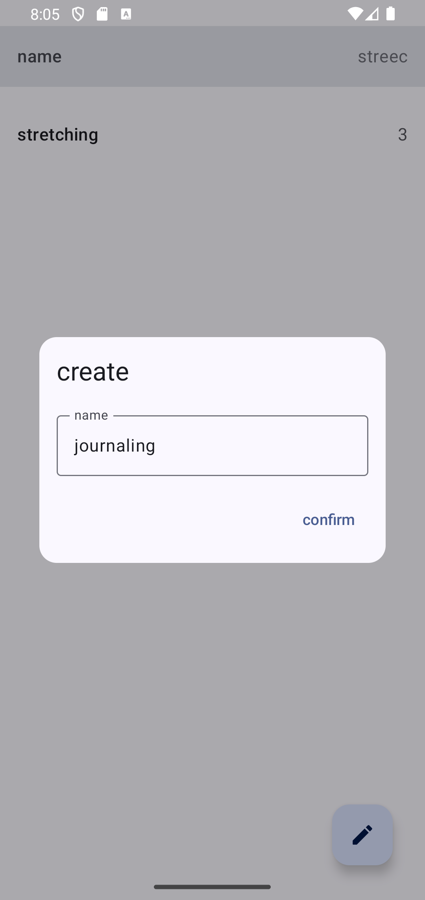
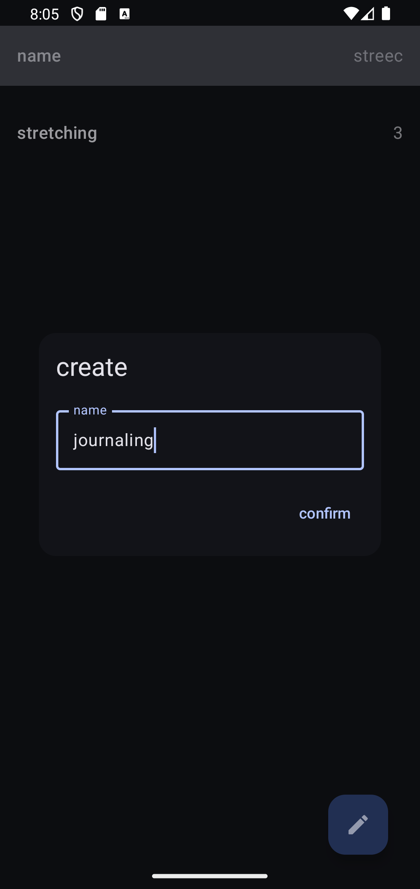

# streec

### What streec Is

streec is a simple activity logger.

### What streec Is Not

streec is not an activity journal.

### Overview

screec counts the number of days since each log.

### Implementation

streec demonstrates the following:

- Dependency injection via [Hilt][hilt]
- Asynchronous processing via [kotlinx.coroutines][coroutines]
- Timestamp management via [kotlinx.datetime][datetime]
- Persistent storage via [Room][room]
- Declarative layouts via [Jetpack Compose][compose]
- Unidirectional data flow via [MVVM][mvvm]
- Modularization via [versions catalogs][versions] and [convention plugins][plugins]

### Setup

Setup simply involves cloning the repository. Run in [Android Studio][android studio] or any Android IDE.

*streec in dynamic light and dark modes*

[hilt]: https://developer.android.com/training/dependency-injection/hilt-android/
[coroutines]: https://github.com/Kotlin/kotlinx.coroutines/
[datetime]: https://github.com/Kotlin/kotlinx-datetime
[room]: https://developer.android.com/training/data-storage/room
[compose]: https://developer.android.com/jetpack/compose/
[mvvm]: https://developer.android.com/topic/architecture/
[versions]: https://docs.gradle.org/current/userguide/platforms.html
[plugins]: https://docs.gradle.org/current/samples/sample_convention_plugins.html

[android studio]: https://developer.android.com/studio
